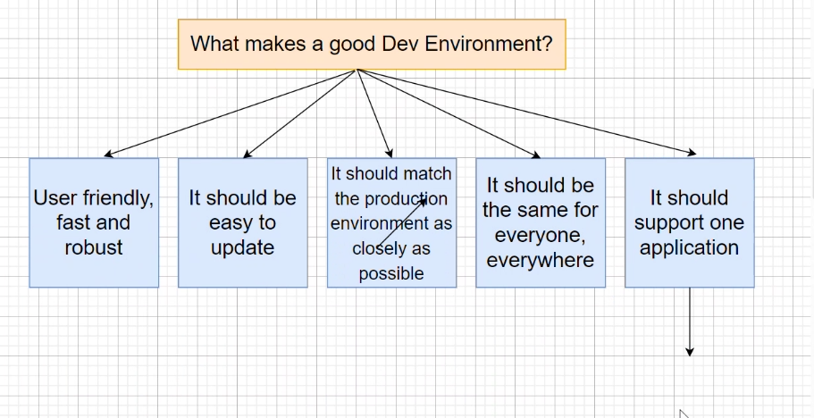
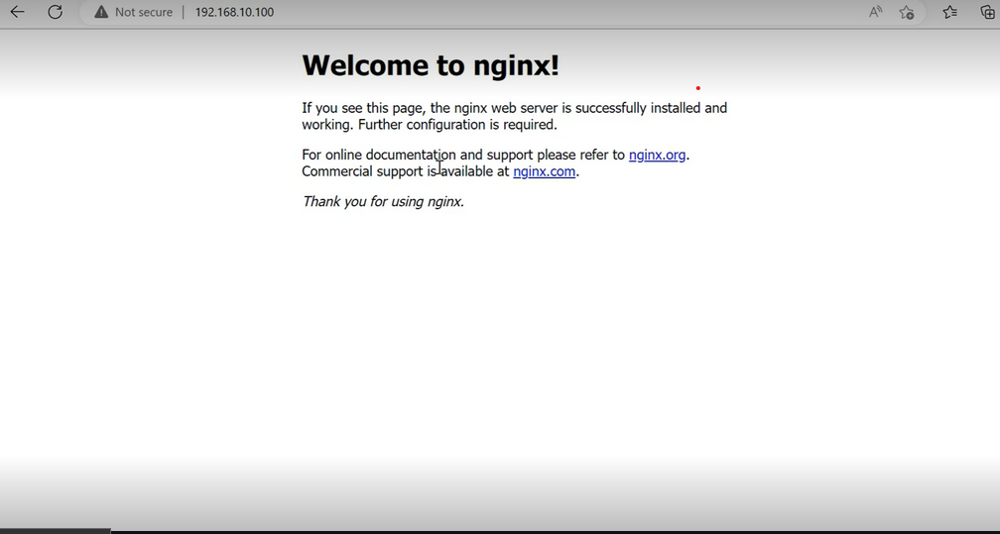

# Virtualization 
v2

## DevOps

## Ease of use- Other teams are going to ise the tools we cerate. they wont use them if they are not user friendly.

## flexibility - it can be easy to get locked in to using a specific product tool or softrware. and then it becomes hard for them to keep up with industy changes .

## Robustness -  we need as close to 100% uptime as possible for our company services 

## Cost -  cost is often overlooked we need to make sure the company is being effcient as possible in its trch dealings.  for example how powerful a machine do we need to conduct a task. Do we nned curtain servers running? ect.
#

## Risk manager 


    Thread agents. This element describes which users to watch out for which pose a threat to your application.
    Attack vectors and scenarios. Describes which kind of attacks are to be expected.
    Detectability. Answers the question of how easy the risk/weak spot can be found by attackers.
    Exploitability. Describes how widespread the vulnerability is and how easy it is to exploit it.
    Impacts. This element describes the impact on the business and technical architecture.


## Infrastructure and architecture

  Monolithic applications consist of a single codebase that interacts with a single database. The application's client interface, single database, frontend, backend and business logic are incorporated into one codebase. There is only one test and deployment pipeline to maintain.

Microservices - Microservices architecture is tailor-made for DevOps with its services-based approach that allows organizations to break down the application into smaller services. This enables delivery teams to tackle individual services as separate entities—ultimately simplifying the development, testing, and deployment.

# DevEnvironments 
  A DevOps development environment should not only edit and debug code, but integrate with the rest of the DevOps cycle, including testing, version control, and production monitoring. Microsoft provides two major development environments to support DevOps, Visual Studio and Visual Studio Code. Allows teams to be standarised and increases development teams worklfow if everyone works in the same environment.

# What makes a good Dev Environment?




# What you need to setup a dev environment 

   ## Vagrant --- Gives instructions to software 
   ```````
   follow download link on vagrant website.
- Common commands:
     box             manages boxes: installation, removal, etc.
     connect         connect to a remotely shared Vagrant environment
     destroy         stops and deletes all traces of the vagrant machine
     global-status   outputs status Vagrant environments for this user
     halt            stops the vagrant machine
     help            shows the help for a subcommand
     hosts           Information about hostnames managed by the vagrant-hosts plugin
     hostsupdater    
     init            initializes a new Vagrant environment by creating a Vagrantfile
     login           log in to HashiCorp\'s Atlas
     package         packages a running vagrant environment into a box
     plugin          manages plugins: install, uninstall, update, etc.
     port            displays information about guest port mappings
     powershell      connects to machine via powershell remoting
     provision       provisions the vagrant machine
     push            deploys code in this environment to a configured destination
     rdp             connects to machine via RDP
     rebuild         plugin: vagrant-digitalocean: destroys and ups the vm with the same ip address
     reload          restarts vagrant machine, loads new Vagrantfile configuration
     resume          resume a suspended vagrant machine
     share           share your Vagrant environment with anyone in the world
     snapshot        manages snapshots: saving, restoring, etc.
     ssh             connects to machine via SSH
     ssh-config      outputs OpenSSH valid configuration to connect to the machine
     status          outputs status of the vagrant machine
     suspend         suspends the machine
     up              starts and provisions the vagrant environment
     vbguest         
     version         prints current and latest Vagrant version
```````

  
  
## Virtual box --- always run as admin 


 ## Ruby --- Download online from Ruby website. To find version in gitbash do "ruby --version" 


 ## Bash 


## Git


## SSH
## How to get Vagrant and virtual box up and running 

- Open your git bash terminal and enter the following "cd(FILENAME")
- Once you've gone that you should now be in the correct file now the command you need to enter is `vagrant init ubuntu/xenial64`. This then this tells vagrant what type of system we want to use
- You should now see the following `A `Vagrantfile` has been placed in this directory. You are now
ready to `vagrant up` your first virtual environment! Please read
the comments in the Vagrantfile as well as documentation on
`vagrantup.com` for more information on using Vagrant.`. Please note that you will also see a vagrant folder locally in "tech201_virtualization" in vscode
- We now used `vagrant up` to boot-up our virtual machine 
- Now we need to securley got into our vm by using SSH in our GitBash terminal. To do this type `vagrant ssh`.
- `ls - a` is to see hidden folders (not mandatory) put important to know 
- We will now use `sudo apt-get`. this is used to get something from the internet.
- To update everything on the OS type `sudo apt-get update -y`
- Next use `sudo apt-get install nginx -y` to install our program for our website
- Finally use `sudo systemctl start nginx` then `sudo systemctl status nginx` to run the website.
- Also in order to make create a fixed address ,so it's easier for developers all we have to do is add `config.vm.network "private_network", ip: "192.168.10.100"` and this goes just before the end statement.
- Now Exit vm using `exit` and use `vagrant reload` to reboot your vm with the new setting. 
- Now when you search the ip you should see 
- 
Well done !
## An Error I faced and how it was resolved.

During the vagrant "up stage" I encountered  an error message that read. 
```` git 
Bringing machine 'default' up with 'virtualbox' provider...
==> default: Box 'ubuntu/xenial64' could not be found. Attempting to find and install...
    default: Box Provider: virtualbox
    default: Box Version: >= 0
The box 'ubuntu/xenial64' could not be found or
could not be accessed in the remote catalog. If this is a private
box on HashiCorp's Vagrant Cloud, please verify you're logged in via
`vagrant login`. Also, please double-check the name. The expanded
URL and error message are shown below:

URL: ["https://vagrantcloud.com/ubuntu/xenial64"]
Error: schannel: next InitializeSecurityContext failed: Unknown error (0x80092012) - The revocation function was unable to check revocation for the certificate.
`````


To troubleshoot this issue I found a perfect article on how to fix it from the following. https://devopslite.com/vagrant-was-unable-to-check-revocation-for-the-certificate/.
After the following these steps I have found that I needed to add the following.
````

config.vm.box_download_insecure=true

````

By doing this it allowe me to complete the installation of the virtual machine on virtual box and has removed the error. The terminal now shows this.


````` 

$ vagrant up
Bringing machine 'default' up with 'virtualbox' provider...
==> default: Box 'ubuntu/xenial64' could not be found. Attempting to find and install...
    default: Box Provider: virtualbox
    default: Box Version: >= 0
==> default: Loading metadata for box 'ubuntu/xenial64'
    default: URL: https://vagrantcloud.com/ubuntu/xenial64
==> default: Adding box 'ubuntu/xenial64' (v20211001.0.0) for provider: virtualbox
    default: Downloading: https://vagrantcloud.com/ubuntu/boxes/xenial64/versions/20211001.0.0/providers/virtualbox.box
Download redirected to host: cloud-images.ubuntu.com
    default:
==> default: Successfully added box 'ubuntu/xenial64' (v20211001.0.0) for 'virtualbox'!
==> default: Importing base box 'ubuntu/xenial64'...
==> default: Matching MAC address for NAT networking...
==> default: Checking if box 'ubuntu/xenial64' version '20211001.0.0' is up to date...
==> default: Setting the name of the VM: trech201_v2_default_1675789868029_27621
Vagrant is currently configured to create VirtualBox synced folders with
the `SharedFoldersEnableSymlinksCreate` option enabled. If the Vagrant
guest is not trusted, you may want to disable this option. For more
information on this option, please refer to the VirtualBox manual:

  https://www.virtualbox.org/manual/ch04.html#sharedfolders

This option can be disabled globally with an environment variable:

  VAGRANT_DISABLE_VBOXSYMLINKCREATE=1

or on a per folder basis within the Vagrantfile:

  config.vm.synced_folder '/host/path', '/guest/path', SharedFoldersEnableSymlinksCreate: false
==> default: Clearing any previously set network interfaces...
==> default: Preparing network interfaces based on configuration...
    default: Adapter 1: nat
==> default: Forwarding ports...
    default: 22 (guest) => 2222 (host) (adapter 1)
==> default: Running 'pre-boot' VM customizations...
==> default: Booting VM...
==> default: Waiting for machine to boot. This may take a few minutes...
    default: SSH address: 127.0.0.1:2222
    default: SSH username: vagrant
    default: SSH auth method: private key
    default:
    default: Vagrant insecure key detected. Vagrant will automatically replace
    default: this with a newly generated keypair for better security.
    default:
    default: Inserting generated public key within guest...
    default: Removing insecure key from the guest if it's present...
    default: Key inserted! Disconnecting and reconnecting using new SSH key...
==> default: Machine booted and ready!
==> default: Checking for guest additions in VM...
    default: The guest additions on this VM do not match the installed version of
    default: VirtualBox! In most cases this is fine, but in rare cases it can
    default: prevent things such as shared folders from working properly. If you see
    default: shared folder errors, please make sure the guest additions within the
    default: virtual machine match the version of VirtualBox you have installed on
    default: your host and reload your VM.
    default:
    default: Guest Additions Version: 5.1.38
    default: VirtualBox Version: 6.1
==> default: Mounting shared folders...
    default: /vagrant => C:/Users/Walee/tech201_virtualisation.git/trech201_v2
``````
This shows that the virtual machine is now up and running via virtual box.


