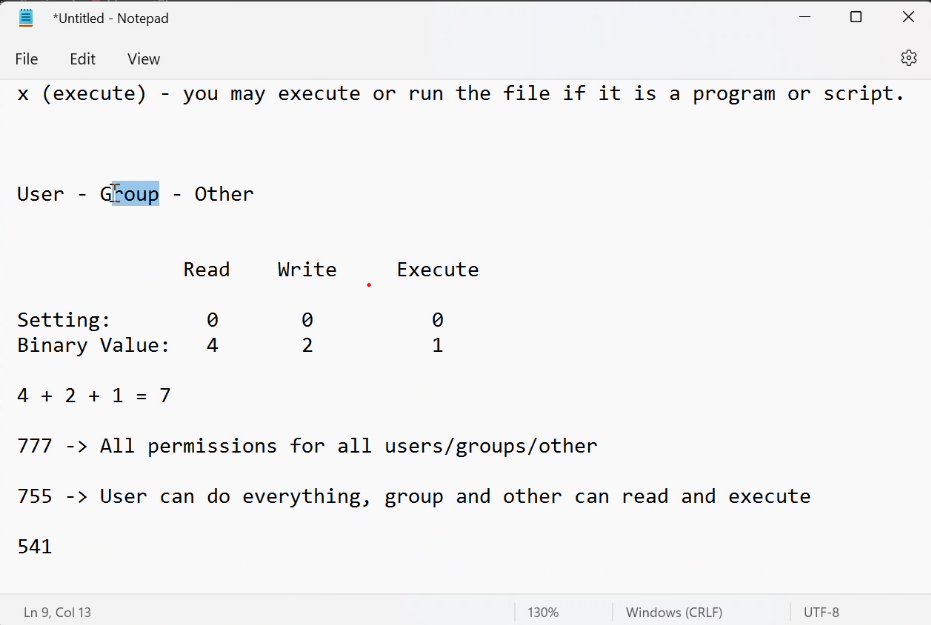
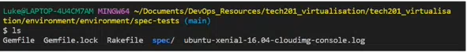
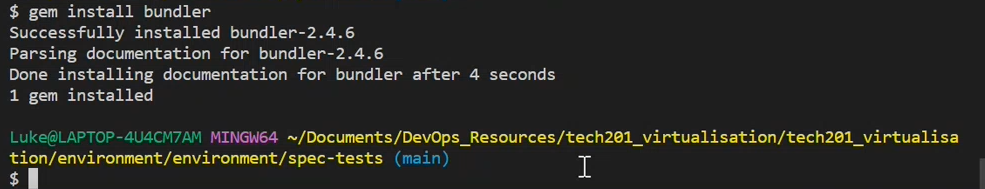
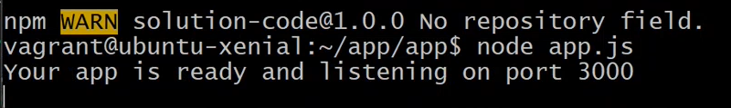
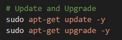
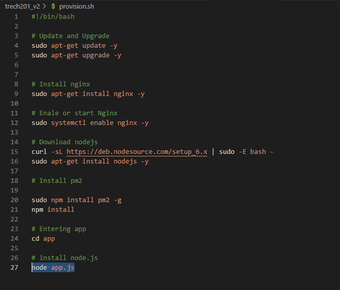
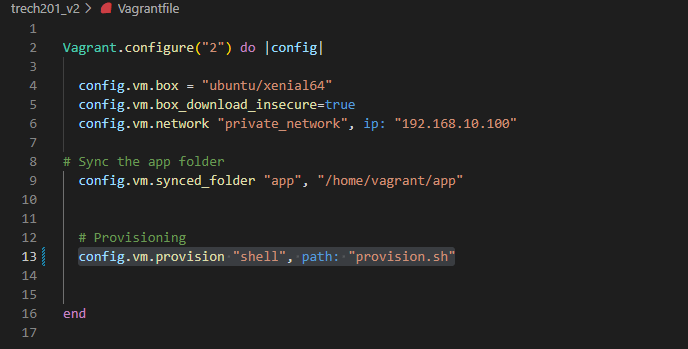
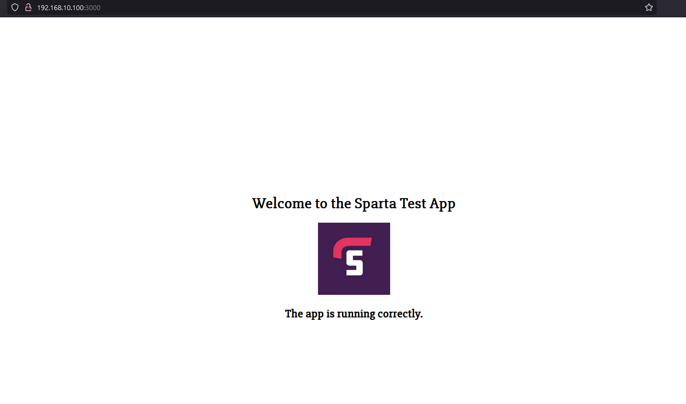

# Advanced bash commands 

- `uname`- shows system info opperation system
- flag- to give linux specific instructions 
- `uname --all`
- ` uname -s`
- `uname -r`
- `uame -m`
- `uname -i`
- `uname -o`
- `uname -si`
- `uname -srp`

# Navigation 

- `cd`- change directory 
- `ls -a` - list
- `cd ..` goes back two
- `cd ../..` goes up two
- `mkdir` make directory 
- `cd /` takes you back to root directory 
-  `cd ~` also takes you back home as a user 
- `ls -l` - lists files with permissions 

### Absolute path format:"C:\user\username\Documents\myfile.txt"
### Relative path : /Folder1/Folder2/file.txt

# Creating files and folders 
- `touch` creates a file 
- `nano` myfile.txt (open nano and type into it to edit file)
- `crtl x ` to exit nano 
- `cat` shows content of the file 

# Creating a Folder 
- ` mkdir` make directory 

# Copy files  
- `cp (name of the file)` space `name of the file youre copying into`
- `cat copied_file.txt`
- `cp myfile.txt new_folder/copied_myfile.txt`
- `cd new_folder`
- `ls` to check if it has copied 
`- cat newcopied_myfile.txt`

# Copy Folder

- `cp -rf`
- `cp -rf new_folder new_folder2` the rf stands for recursive copy anything inside the folders and the f stands for "forced"
- `cd new_folder`
- `rsync -r` new_folder new_folder2 (the outcome will be that the two folders are now combined it will make a third folder)

## Moving files 

- `mv` is how you move a file 
- `mv my_file2.txt new_folder/`
- `mv myfile2.txt ../../` will move a file two files back

## Deleting files 
- `rm` remove 
- `rm new_file.txt` this will remove with no checks 
- `rm -rf (folder name)` delete a folder and everything inside
- ` rm -rf` NEVER TYPE THIS IN 

- `man .ls ` loads of info 

# How to search in linux
- `grep`
- `grep test file.txt`
- Do * and that does all the files in this folder 
- `grep test * -R` this tells linux to search all folders and folders within folders 

## Wildcards

- `ls f*` this will show all files with ls but only the ones with "f" inside it 
- `ls -l` this will list permissions 
- `- r`- the r stands for read 
- ` -w`- write permissions 
- ` - x` being able to execute the file 
- `sudo chmod` change permissions 
- `u+x testfile.txt` the plus is used to add permissions and the u stands for users 
- `sudo chmod 777 (file name)` gives everyone all permissions 
- `top` gives all running processes 
- `ps` shows your processes 
- `ps aux` all background systems 
- `kill` kills a process 
- `kill -9` is used to get rid of a really stubborn process 
- `&` is used to run in the background, so you don't get locked out of your terminal 
- `fg` can be used to bring back a process 
- `crtl z` ends a process 
- `tree` works like ls however it looks a bit better 
- 
## The three diffrent sets of people

- Owner (u)
- Group (g)
-  Others/all (o)

# How to get your app up and running

- First you need to `cd` into environment in vs code
- if nested `cd` inot environment again
- Then `cd` in spec-test
- Now you need to hit `ls`
- You should see the following 
- Run `gem install bundler` ruby testing framework 
- Run `bundle` should only need to do it once 
- run `rake spec` this test your environment 
- `sudo apt-get update -y`
- `sudo apt-get upgrade` - be careful with upgrade 
- Once you have done that run `sudo apt-get install nginx`
- Run `sudo systemctl enable nginx` 
- Now at this point what you can do is check to see nginx is working for you using the ip address
-  Once all steps on `rake spec` are green go into app folder using `cd app`. Now `npm install` this is to install the app. `node app.js` this will run in the foreground and not allow you to do anything. once that is complete you should see
- This means that we have deployed our developers' application.

- Finally, oyu need to go back to your browser and on the app you need to access it on `port 3000`. and once you do that you should see your working app.

## Provisioning 

- First you need to create a file and name it "provision.sh"
- You will now need to add the following code to your top line. `#!/bin/bash` . this lets you know that it is a script and it needs to be run in the terminal.
- Now we need to add  update and upgrade by doing `sudo apt-get update -y
sudo apt-get upgrade -y` and it should now look like this 
- We now need to Install Nginx by doing the following. `sudo apt-get install nginx -y`
- We now need to start Ngingx and you will do this by. `sudo systemctl enable nginx -y`
- Now we need to download nodejs and we will do that by entering the following. `curl -sL https://deb.nodesource.com/setup_6.x | sudo -E bash -
sudo apt-get install nodejs -y`.
- We need to now Install pm2 and we will do that entering the following. `sudo npm install pm2 -g
npm install
`
- This step is extremely important because we need to make sure we `cd` into our app folder because we need to find `app.js` in our app folder.
- Lastly we need to install node.js and we will do this by. Entering `node app.js`. 
And it should look like so :

## Update your Vagrant folder 

- To your vagrant folder you need to add the following. `config.vm.provision "shell", path: "provision.sh"`

- Now with all of these steps complete your app should be ready to use on you IP address please note you need to add "3000" at the end of the ip for this to work. And it should look like so.
- 
