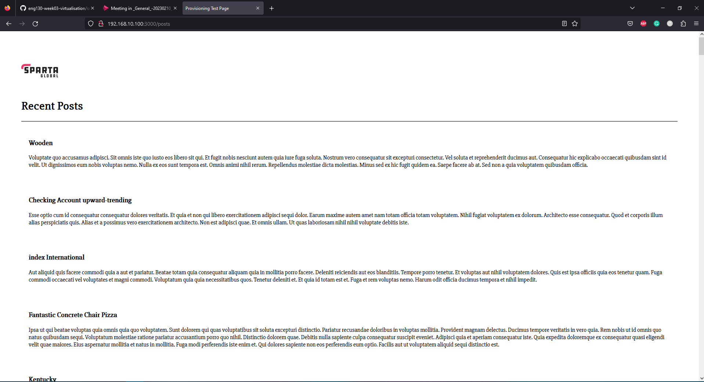
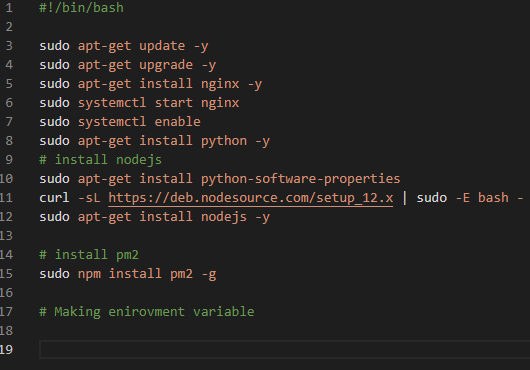
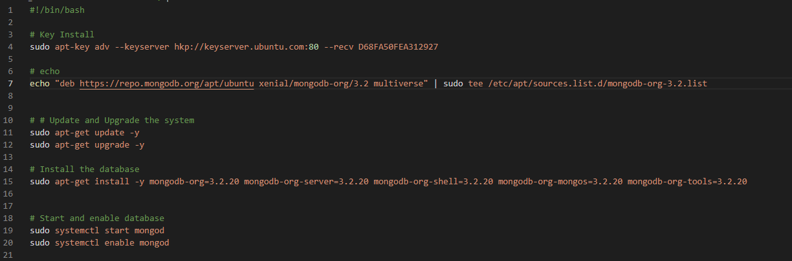
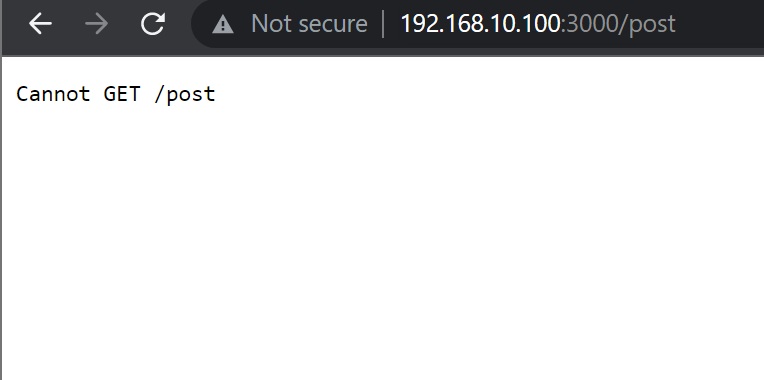

#  What is a port? 

- A port is a virtual point where network connections start and end. Ports are software-based and managed by a computer's operating system. Each port is associated with a specific process or service.

# What is a reverse proxy? How is it different to a proxy?

- A reverse proxy is a server that acts as an intermediary between clients and a web server. It forwards client requests to the web server and returns the server's responses back to the clients. It is used for load balancing, authentication and authorization, SSL/TLS acceleration, and content caching to improve performance and security. The main difference between a reverse proxy and a forward proxy is the direction of the connection, with a reverse proxy serving as an intermediary for servers, and a forward proxy serving as an intermediary for client devices.

image taken from imperva.com 

# What is Nginx's default configuration? 

`sudo nano /etc/nginx/sites-available/default`

# How do you set up a Nginx reverse proxy?

- So you need to start by entering the following `sudo nano /etc/nginx/sites-available/default`
- You now need to specify the location and port `server {
...
    location /app {
        proxy_pass http://localhost:3000/;
        proxy_http_version 1.1;
        proxy_set_header Upgrade $http_upgrade;
        proxy_set_header Connection 'upgrade';
        proxy_set_header Host $host;
        proxy_cache_bypass $http_upgrade;
    }
...
}`
- we want to go into our default settings and add app to the location 

- We now need to input `sudo nano /etc/nginx/sites-available/default` this allows us to access the default settings. and replace our location remove `try_files $uri $uri/ =404 line with the proxy_pass`. with `proxy_pass http://localhost:3000;`.
- You now need to restart using `sudo systemctl restart nginx`
- And once you refresh your web page you should now be able to access the page without seeing `:3000`.

## How to connect your app to your DB.

- first you need to add your sudo add relsesase key for mongo.
- then add your echo commaand 
- now apt-get update. to confirm any updates 
- now sudo apt-get upgrade
- now you need to install mongo 3.2.2
- check satus to see if its there
- now we want to start it using `sudo systemctl start mongod`
- Now `enable mongod`
- we now need to change a particular file by using `sudo nano`
- the folder is in /ect/mongod.conf
- scroll to network interfaces and change the bindip to 0.0.0.0 (the best practice recommends to put in your specific ip)
- now we need to restart mongo DB using sudo systemctl restrt mongod
- now we need to enable using sudo systemctl enable mongod
- at this stage run a status check

Now move to app

- An envirmonment variable allows us to specify information of our envirmonmnet its needed to connect app to database 
- `MY_VAR=hello`
- `echo $MY_VAR` To see content of variable 
- a noraml variable is only acessable in the current process youre running. 
- An environment variable makes it accesable to the environment.
- `export my_var=hello` this makes your evniroment variable
- `sudo nano .bashrc` (add image)
- now run this file using `source .bashrc`
- now `printenv`
This gives the app the information needed to connect to the db.
- Now `export db_host=mongodb://192.168.10.150:27017/posts`
- `printenv db_host`
- now cd into app 
-`pnm install`
- node seeds/seed.js this creates the database 
- `node app.js`

- And if all went well you should see the following. 
- 

# Automate Multimachine Vagrant 

Stage 1:

- In this we needed to Find a way to provision the database vm in your Vagrantfile. Note the provision file for the database(db) machine needs to be separate and thus in a separate folder.

Provision it to have MongoDB after a 'vagrant up'

Get /posts working. 

Frst we created provioning files for both app and database which looked like this.

App:

Database: 

 -What this now allows us to do is have our database provisioned when we run `vagrant up`
- I have not seeded by database just yet so at this stage you should see the following:
- 

In Stage 2 we will do the following. Find a way to start and enable MongoDB in your provision file.

Find a way to edit the mongod.conf via your db provision file.

Get /posts working. All you should need to do now after 'vagrant up' is enter the app vm and export the env variable. From there you should simply navigate to the correct folder and run the normal commands to start the app:

npm install
node seeds/seed.js
npm start.