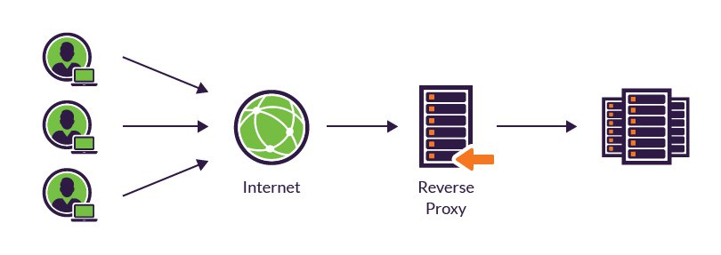

#  What is a port? 

- A port is a virtual point where network connections start and end. Ports are software-based and managed by a computer's operating system. Each port is associated with a specific process or service.

# What is a reverse proxy? How is it different to a proxy?

- A reverse proxy is a server that acts as an intermediary between clients and a web server. It forwards client requests to the web server and returns the server's responses back to the clients. It is used for load balancing, authentication and authorization, SSL/TLS acceleration, and content caching to improve performance and security. The main difference between a reverse proxy and a forward proxy is the direction of the connection, with a reverse proxy serving as an intermediary for servers, and a forward proxy serving as an intermediary for client devices.

image taken from imperva.com 

# What is Nginx's default configuration? 

`sudo nano /etc/nginx/sites-available/default`

# How do you set up a Nginx reverse proxy?

- So you need to start by entering the following `sudo nano /etc/nginx/sites-available/default`
- You now need to specify the location and port `server {
...
    location /app {
        proxy_pass http://localhost:3000/;
        proxy_http_version 1.1;
        proxy_set_header Upgrade $http_upgrade;
        proxy_set_header Connection 'upgrade';
        proxy_set_header Host $host;
        proxy_cache_bypass $http_upgrade;
    }
...
}`
- we want to go into our default settings and add app to the location 

- We now need to input `sudo nano /etc/nginx/sites-available/default` this allows us to access the default settings. and replace our location remove `try_files $uri $uri/ =404 line with the proxy_pass`. with `proxy_pass http://localhost:3000;`.
- You now need to restart using `sudo systemctl restart nginx`
- And once you refresh your web page you should now be able to access the page without seeing `:3000`.

